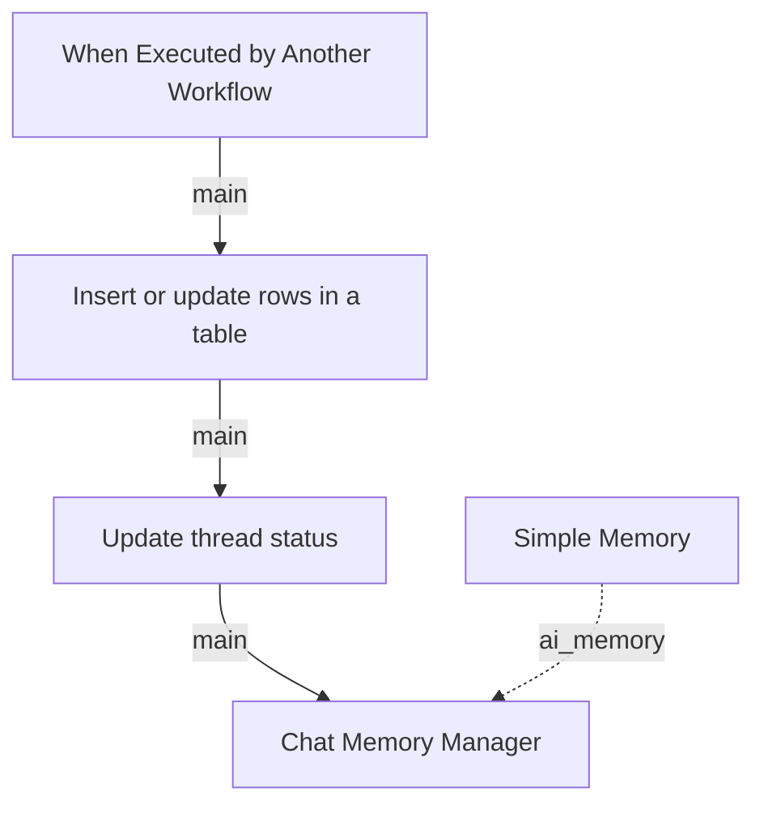

# exit

Source: `workflows/remote/dev_4/subagents/Invoice agent/tools/exit.json`

Purpose:
Closes an invoice conversation cleanly.

Technical flow:
It updates the thread status, stores a terminal state in Postgres, and resets or records memory so the invoice agent does not continue treating the thread as active.

## Diagram

