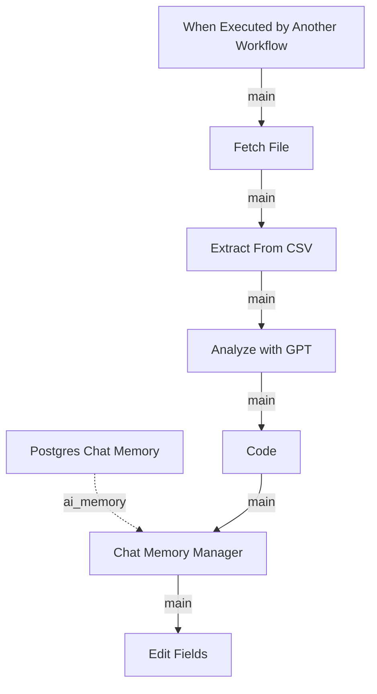

# Extract Payment Info from CSV File abd

Source: `workflows/remote/dev_4/subagents/Payment agent/tools/Extract Payment Info from CSV File abd.json`

Purpose:
Extracts payment instructions from a CSV upload.

Technical flow:
It fetches the CSV file, parses rows, runs an AI analysis step to interpret the payment information, uses code to normalize the result, and returns a cleaned payment payload to the payment agent.

## Diagram

