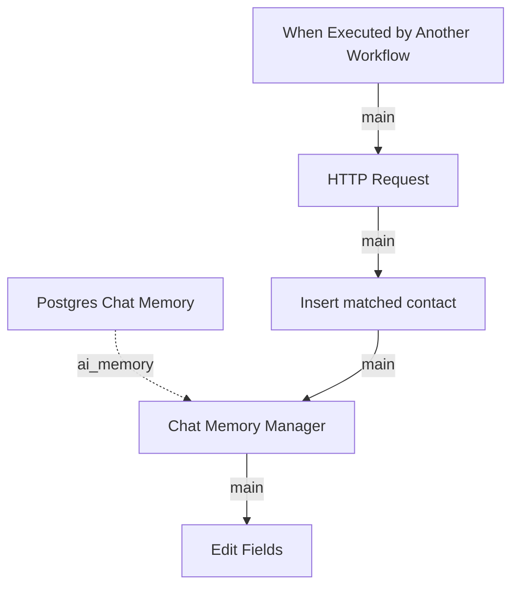

# Get invoice/bill details

Source: `workflows/remote/dev_4/subagents/Payment agent/tools/Get invoice_bill details.json`

Purpose:
Fetches the accounting-system details for the invoice or bill being paid.

Technical flow:
It calls an HTTP endpoint to fetch invoice or bill details, persists the normalized result into local state, and stores the context in chat memory so the payment agent can reason about the target document during posting or reconciliation.

## Diagram

